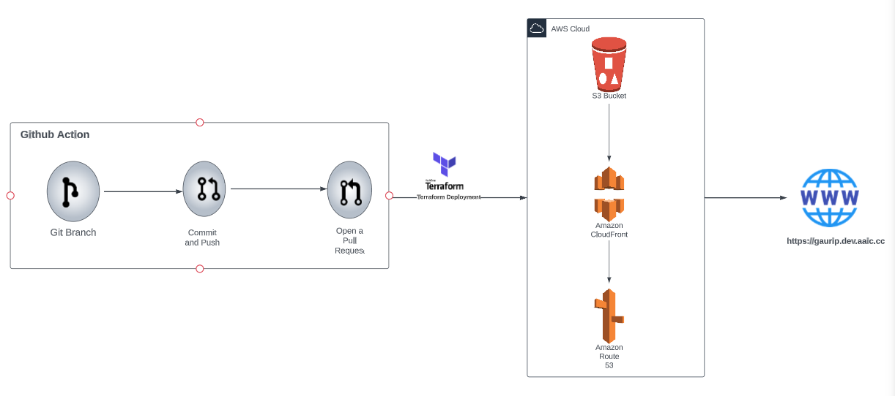

## Deploy Website with GitHub Actions and Terraform

## Objective:
The objective of this project is to create a simple HTML website hosted at https://gauri.dev.aaic.cc. The website should be deployed to an S3 bucket and served through a CloudFront distribution. Additionally, the Route53 domain should be configured to point traffic to the CloudFront Alias.

## Architectural Diagram: 

## Requirements

| Name      | Version |
| --------- | ------- |
| terraform | ~> 3.0  | 

## Providers

| Name | Version |
| ---- | ------- |
| aws  | ~> 3.0  |

## Inputs

| Name         | Description                                                                                           | Type           | Default | Required |
| ------------ | ----------------------------------------------------------------------------------------------------- | -------------- | ------- | :------: |
| aws_region   | Name of AWS region in which you want to create resources                                              | `string`       | ""      |   yes    |
| bucket_name  | A unique name for your bucket.                                                                        | `string`       | ""      |   yes    |
| domain_name  | The name of the website.                                                                              | `string`       | ""      |   yes    |
| aws_route53_zone   | Name of existing/new route53 zone where records will be created.                                | `string`       | ""      |   yes    |
| aws_route53_record | Name for the records that will be created in the hosted zone.                                   | `string`       | ""      |   yes    |
| cloudfront_distribution_id | Provide the cloudfront distribution id.                                                 | `string`       | ""      |   yes    |
| validate_certificate  | Amazon certificate manager validation                                                        | `bool`         | "True"  |   yes    |
| bucket_versioning  | Enable if bucket versioning is required.                                                        | `bool`         | "False" |   yes    |
| website_additional_domains | An alternate name for the website.                                                      | `string`       | ""      |   yes    |

## Steps to Create Terraform Code for Infrastructure Automation:
- Terraform Installation (Skip if already done):
- Terraform is an infrastructure-as-code tool used to define and provision infrastructure resources. Ensure Terraform is installed on your local machine or the GitHub Actions runner.
- If using GitHub Actions, the installation step for Terraform can be seen in the provided workflow file.
Create Terraform Configuration Files:
- In the root directory of your GitHub repository, create a new directory (e.g., terraform) to store the Terraform configuration files.

S3 Bucket Configuration (terraform/s3.tf):
- Define the Terraform code to create an S3 bucket to host your static website.
-Specify the bucket name, access control configuration, and enable website hosting.

CloudFront Configuration (terraform/cloudfront.tf):
- Define the Terraform code to create a CloudFront distribution to serve your website from the S3 bucket.
- Configure the CloudFront settings, including origin settings and default behavior.

Route53 Configuration (terraform/route53.tf):
- Define the Terraform code to configure a Route53 record to point to the CloudFront distribution.
- Specify the DNS configuration for your custom domain (e.g., gauri.dev.aaic.cc) to map it to the CloudFront distribution.

ACM Certificate Configuration (terraform/acm.tf):
- Define the Terraform code to request and validate an ACM certificate for your custom domain (e.g., gauri.dev.aaic.cc).
- Specify the validation method for the certificate request, which can be DNS validation using Route53.

Main Terraform Configuration File (terraform/main.tf):
- In this file, include references to all other Terraform configuration files (s3.tf, cloudfront.tf, route53.tf, acm.tf).
- Configure any additional Terraform settings, such as provider information (AWS provider version, region, etc.).

Input Variables and Outputs:
- Consider defining input variables and outputs in separate .tf files to make the Terraform code more modular and reusable.
- Input variables can allow you to specify values dynamically at runtime, while outputs can provide useful information after Terraform applies the changes.

Terraform Backend Configuration (Optional):
- configure Terraform backend to store state files remotely (e.g., in an S3 bucket) for collaboration and better state management.

GitHub Actions Terraform Execution:
- In the provided GitHub Actions workflow file, the steps for running Terraform commands (terraform init, terraform apply, etc.) have been added.
- Ensure the workflow references the correct Terraform files (e.g., terraform/*.tf) to apply the desired configurations.
- After completing these steps, your Terraform code will automate the setup and configuration of S3, CloudFront, Route53, and ACM certificate. Whenever you push changes to the main branch of your GitHub repository, the GitHub Actions pipeline will automatically execute Terraform to deploy and update your website infrastructure.

GitHub Actions Pipeline Setup:
- Configure a GitHub Actions workflow to automatically update the website whenever a pull request is merged into the main branch.
- The workflow will use Terraform to deploy the S3 bucket, CloudFront distribution, ACM certificate, and Route53 configurations.

Website Deployment with Terraform:
- Terraform is used to define the infrastructure as code for the S3 bucket, CloudFront distribution, ACM certificate, and Route53 configurations.

Website Code:
- Create a simple HTML website with the desired content to be hosted on the S3 bucket.
Configuration Secrets:
- Store the necessary AWS credentials (AWS_ACCESS_KEY_ID, AWS_SECRET_ACCESS_KEY, and AWS_SESSION_TOKEN) as secrets in the GitHub repository.

## Deployment Steps:
- On each push to the main branch, the GitHub Actions workflow will trigger the following deployment steps using Terraform:
- Initialize Terraform (terraform init).
- Deploy the S3 bucket for the website (terraform apply -auto-approve -target=aws_s3_bucket.website_bucket).
- Deploy the CloudFront distribution (terraform apply -auto-approve -target=aws_cloudfront_origin_access_identity.  origin_access_identity   -target=aws_cloudfront_distribution.s3_distribution).
- Fetch the CloudFront distribution ID and set it as an environment variable.
- Deploy the ACM certificate (terraform apply -auto-approve -target=aws_acm_certificate.ssl_certificate).
- Deploy the Route53 configurations (terraform apply -auto-approve -target=aws_route53_record.www-a -target=aws_route53_record.cert_validation).
- Configuration Steps:
- Create a new private GitHub repository.

## Add the HTML website code to the repository.

- Save the keys as secrets in the GitHub repository with the names AWS_ACCESS_KEY_ID, AWS_SECRET_ACCESS_KEY, and AWS_SESSION_TOKEN.
- Commit and push the changes to the main branch of the repository. The GitHub Actions workflow will be triggered, and the website will be deployed to the specified S3 bucket, served through CloudFront, and the Route53 domain will be configured accordingly.
- Access the website at the provided domain name. The website https://gauri.dev.devopsinabox.aaic.cc once the deployment is successful.